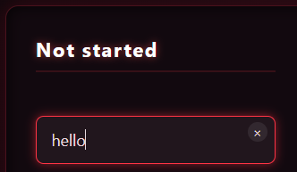
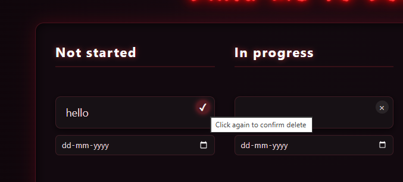
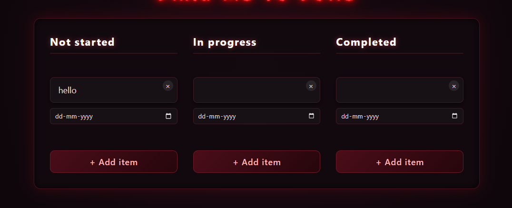

# Drag Me to Done - Dangerous Kanban Board

**A Horror Themed and Adwanced Kanban Board Built Using JS,HTML and CSS without using any Framework that will work on your browser**

# Features:
 1. **Drag and Drop baased UI interface**

  

 2. **Inline editable interface so you can edit while clicking it**

 

 3. **Delete confirmation also is in it if you press delete icon it ask again for confirmation**

 

 4. **Due date also in it because to find when it wrote**

 

 5. **Local storage also available so when you close browser or refreshes the browser it wil not gone**

 6. **Fully Respnsive Design so it works on laptops,desktops,tablets and phones etc**

 7. **Fully Themed UI - In this website this is horror based UI with dark and flickering Horrors**

# Project Structure

├── index.html
├── style.css
├── script.js
├── kanbanapis/
│ ├── kanban.js
│ └── kanbanstoreapi.js
└── items/
├── column.js
├── item.js
└── dropzone.js

# Using 

1. **Clone the repo using "git clone https://github.com/JazilJafar/Dangerous-kanban-board.git**"

2. This is module so index.html not fully works on browser so you do that 
    go to terminal and say "npm serve ." or using python say "python3 -m http.server 8000" then open http://localhost:8000 in the browser 
    also you can use live server in the VS Code

# license

MIT - free to use and modify